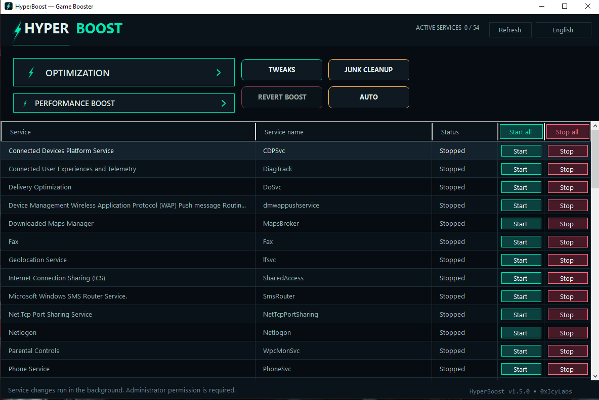

# 📖 HyperBoost — Usage Guide

Everything you need to run HyperBoost. Build it yourself? See [BUILDING.md](BUILDING.md).

## Requirements

- Windows 10 or 11 (x64)
- Administrator rights (required to manage services and apply tweaks)

## Getting started

1. Download `HyperBoost v1.5.0.exe` from the [Releases](releases/latest) page.
2. Run it — accept the **UAC prompt** (administrator rights are required).
3. That's it. No installation — it runs portable. Your data (game list, settings, recovery state) lives in `%LOCALAPPDATA%\HyperBoost`.

> **SmartScreen warning?** The exe is unsigned, so Windows may show *"Windows protected your PC"*. Click **More info → Run anyway**. Some antivirus engines also flag unsigned tools as a false positive — you can always build it yourself from this open source repo.

---

## ✨ Features

| Feature | What it does |
|---|---|
| 🛠 **Service control** | Grid of **57 services** commonly disabled for gaming — only ones installed on *your* PC are shown, running ones first. Start/stop per service or all at once. |
| 🚀 **OPTIMIZATION** | One click: stops all configured services in parallel, flushes RAM, then reports exactly how much was freed. |
| ⚡ **PERFORMANCE BOOST** | Anti-stutter pack in one pass (power plan + GPU + timer resolution + **all 6 gaming tweaks** + RAM monitor). |
| ↩️ **REVERT BOOST** | Reverts everything BOOST changed — runs automatically when the app closes. |
| 🧹 **JUNK CLEANUP** | Windows Temp, user temp, Windows Update cache. |
| 🎮 **GAME AGENT** | Auto-boosts when a game starts, auto-reverts when you leave. Hotkey **Ctrl + Alt + B**, tray icon, launch-at-startup. |
| 🛡️ **RECOVERY** | If a boost was interrupted (crash / force-kill), next launch offers one-click restore. |
| 🧩 **6 GAMING TWEAKS** | Game Mode, Game DVR off, network QoS, foreground priority, PCIe/USB/CPU power. All saved and fully reversible. |
| 🌍 **6 languages** | English / 日本語 / 한국어 / 中文 / Français / العربية (RTL supported) — switch from the top-right menu anytime. |

---

## 🛠 Service control

- The grid lists only services **installed on your machine**, running ones first.
- **Start / Stop** buttons work per row; the header buttons do it for **all** services.
- **"Start all" is a baseline restore**: it only restarts services that were running when HyperBoost launched — it will never force-start a service you deliberately disabled.
- Stopping is **dependency-aware**: services in use by others are stopped first, in order.
- Windows-protected services (Search, Touch Keyboard, Server, Program Compatibility Assistant) are not listed — they can't be reliably stopped.

## 🚀 One-click OPTIMIZATION

Stops every stop-able configured service in parallel, flushes memory working sets and the system standby list, then shows the **amount of RAM freed** in the status bar.

## ⚡ PERFORMANCE BOOST

Applies the full anti-stutter pack in one pass:

1. **Ultimate Performance power plan** — activates it (auto-registers the hidden scheme if missing; falls back to High Performance). Your previous plan is remembered for the revert.
2. **GPU persistence mode** (NVIDIA, where supported) — keeps the driver resident in memory.
3. **Timer resolution** — requests high-resolution timers for smoother frame pacing.
4. **RAM monitor** — keeps an eye on memory pressure while boosted.
5. **All  gaming tweaks** — Game Mode, DVR off, network QoS, foreground priority, PCIe/USB/CPU power (identical to the TWEAKS panel).

## ↩️ Reverting

- **REVERT BOOST** undoes everything above.
- Closing the app **always reverts automatically**.
- If the process is force-killed, timer resolution resets by itself and **RECOVERY** restores your power plan on the next launch.

## 🎮 Game agent

1. Open **GAME AGENT** and register your games (browse to the .exe).
2. HyperBoost boosts automatically when a game starts and reverts when you leave it.
3. Global hotkey **Ctrl + Alt + B** toggles boost/revert from anywhere; a tray icon keeps quick controls at hand. Optionally launch at Windows startup.

## 🧹 Junk cleanup

Tick the locations you want, let it measure the sizes, then **CLEAN**. Locked/in-use files are skipped silently.

## 🧩 Tweaks

All  tweaks are **saved before they change** and fully reversible — registry values and power settings alike. Apply, revert, or restore individual tweaks from the checklist.

---

## 🛡️ Safety & privacy

- **Fully reversible.** Every setting is saved before it changes and restored on revert / exit.
- Uses only **documented** Windows mechanisms — `powercfg`, `nvidia-smi`, service/SDK APIs, documented registry settings.
- **Never** disables your antivirus, **never** force-kills tasks, and **never** touches registry keys outside the small documented set behind the TWEAKS panel.
- No telemetry, no network access, no background services installed.

---

*HyperBoost v1.5.1 • 0xIcyLabs*
